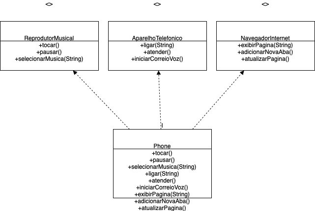

# 📱 Diagrama UML - iPhone

Este projeto representa a modelagem UML do componente iPhone, com base no vídeo de lançamento de 2007. O iPhone é representado com três funcionalidades principais:

- 🎵 Reprodutor Musical
- 📞 Aparelho Telefônico
- 🌐 Navegador na Internet

---

## 📐 Diagrama UML

